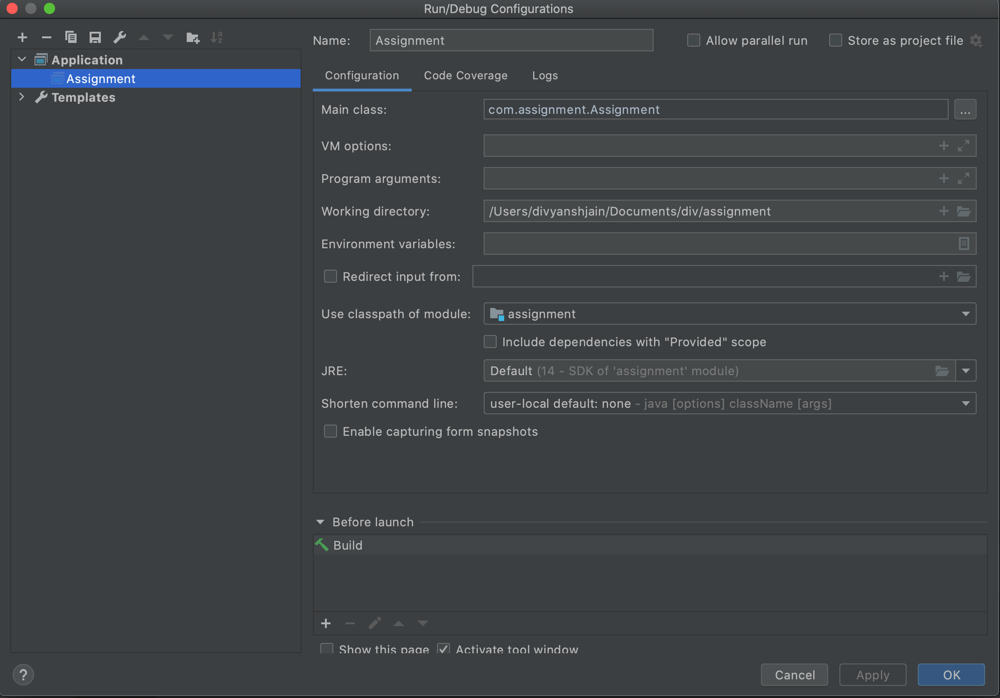

# Assignment

CreatedBy : Divyansh Jain

# How to run the code

The Assignment.java is the main Java class of this project. You can run it in intellij using the Application plugin in configurations as shown below.




# Features implemented

The below features have been implemented

There are two user roles in the project : USER and ADMIN
    
   1. addUser userName role
    usage: addUser divyansh ADMIN
   
   2. addTopic topicName userName
    usage: addTopic topic_notify_users divyansh
    
   3. subscribeTopic topicName userName
    usage: subscribeTopic topic_notify_users divyansh
    
   4. publishMessage messageBody
    The messageBody can be passed as below:
    publishMessage :1_notifyUsers_hi there
    `NOTE : There should be a space b/w publishMessage and :`
    
    ```
    The messageBody consists of id_topicname_message
    eg:  1_notifyUsers_hi there
    ``` 
    
   5. processMessages
    The processMessages feature is implemented as a command line argument and processes all the messages in all the topics when called.